# My first M0 Design: Mini M0
### Motivations

MSPM0 micros are an important new device from TI

Being brand new, there's not a lot of public designs done that aren't hefty launchpads or niche additions to large reference designs. 

I was motivated to do a project to make myself a tiny litle M0 dev board similar to the [STM Nucleo boards.](https://www.digikey.com/en/products/detail/stmicroelectronics/NUCLEO-F303K8/5428805/)

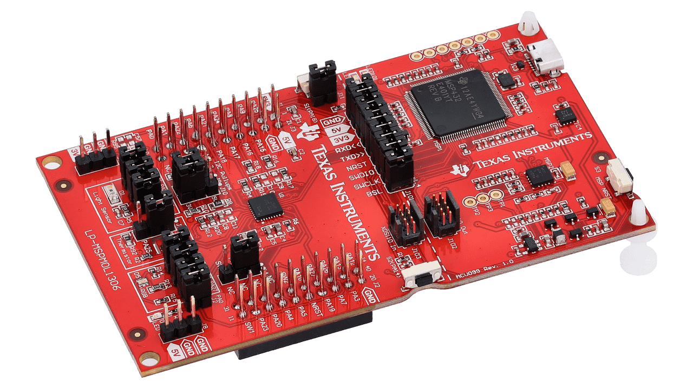

Instead of making large bulky M0 launchpad, I'll make a very minimalist board with basic GPIO pins and a programming header.

There are quite a few MSPM0 models to choose from. We will use the MSPM0G3507 as our MCU as it is smack dab in the middle of the catalog in terms of price and performance. The lessons from this design will scale up to more complex devices and down to smaller cost-sensitive ones.
### How to start

This can be done with schematic/PCB software of your choosing. I chose to go with KiCAD in this. The first step is importing the MSPM0G3507 schematic symbol and footprint into a blank schematic. I in particular used the *MSPM0G3507SRHBR* package

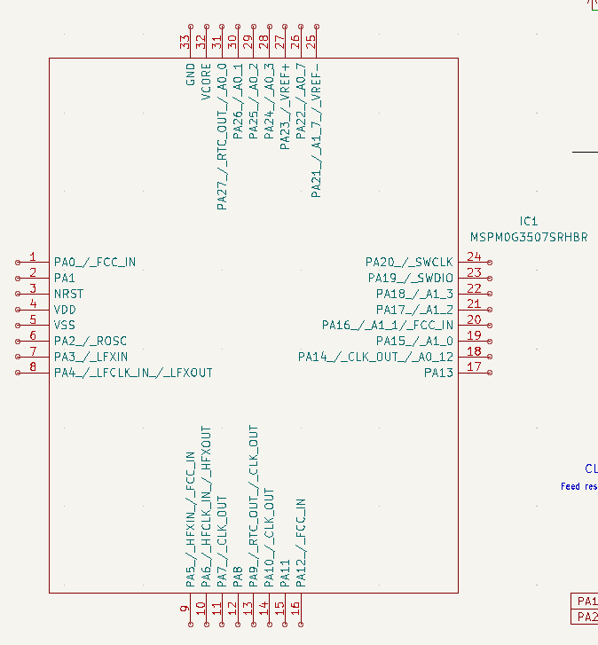

### Part Selections

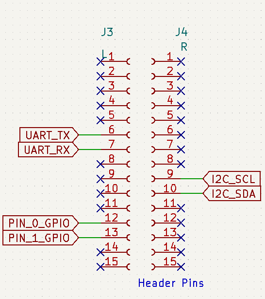

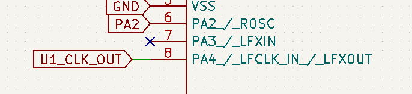

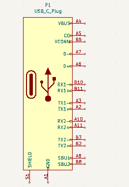

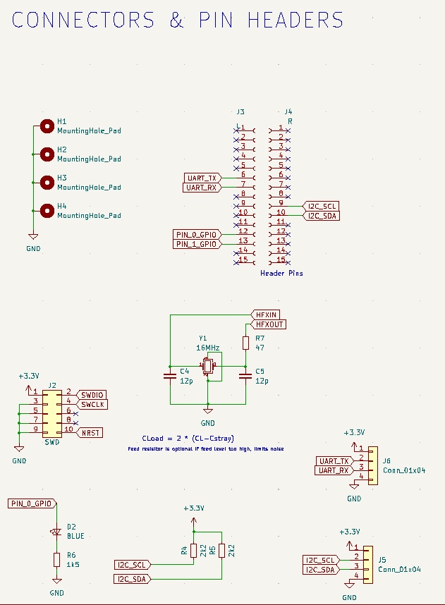

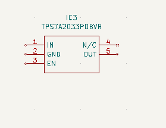

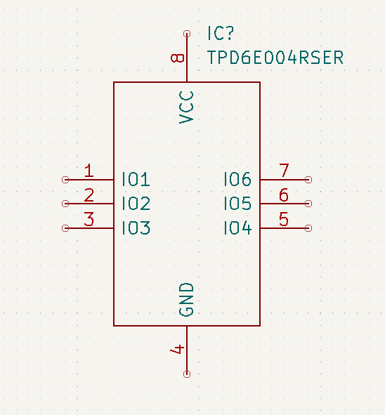

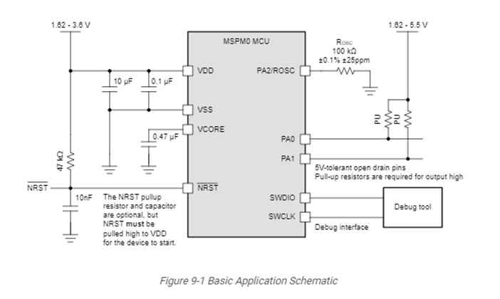

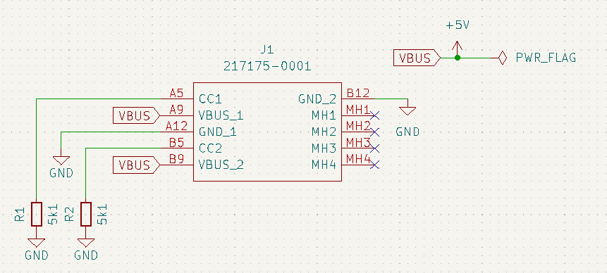

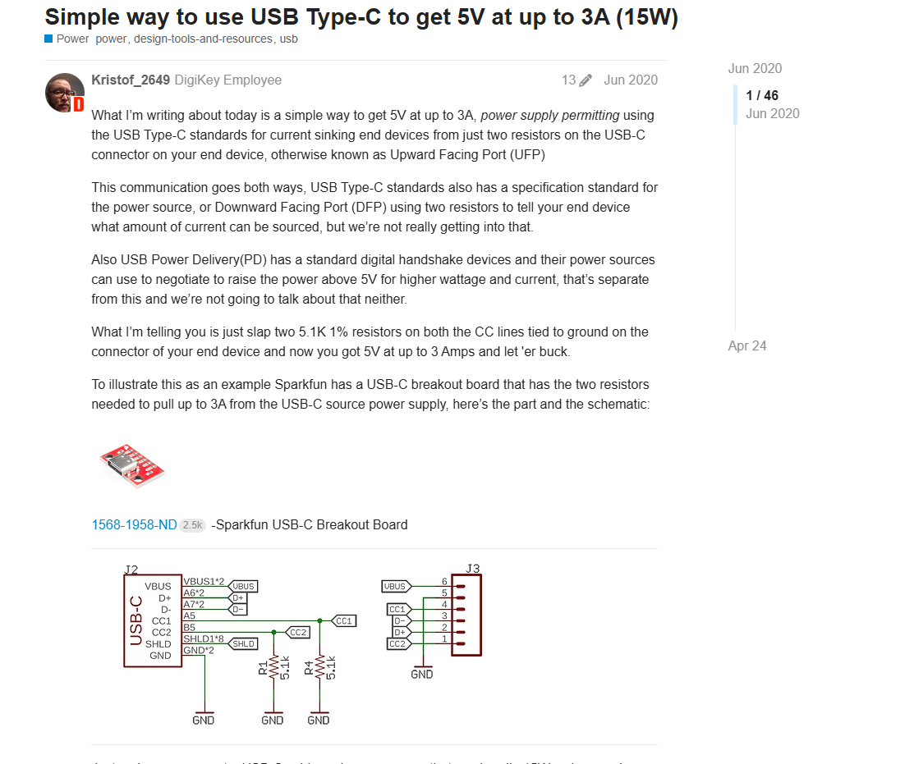