# My first M0 Design: Mini M0
### Motivations

MSPM0 microcontrollers are an important new device from TI.

Being brand new, there's not a lot of public designs done that aren't hefty launchpads or niche additions to large reference designs. 

I was motivated to do a project to make myself a tiny litle M0 dev board similar to the [STM Nucleo boards.](https://www.st.com/content/ccc/resource/technical/document/data_brief/b1/d8/13/d4/b0/b7/4b/6e/DM00214578.pdf/files/DM00214578.pdf/jcr:content/translations/en.DM00214578.pdf)

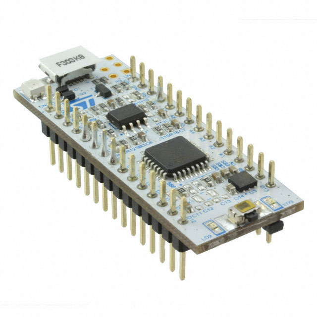

Instead of making a large bulky M0 launchpad, I made a very minimalist board with basic GPIO pins and a programming header. In this document I will show how to recreate my work step by step for anyone making their first MSPM0 design.

There are quite a few MSPM0 models to choose from. I used the MSPM0G3507 as our MCU as it is smack dab in the middle of the catalog in terms of price and performance. The lessons from this design will scale up to more complex devices and down to smaller cost-sensitive ones.
### How to start

This can be done with schematic/PCB software of your choosing. I chose to go with KiCAD in this. The first step is importing the MSPM0G3507 schematic symbol and footprint into a blank schematic. I in particular used the *MSPM0G3507SRHBR* package.

### Part Selections

You will see for an equivalent STM32 processor from STMicro, there is a requirement for heavy input capacitance on the VDD and AVDD pins. MSPM0 has a lesser requirement. One simply needs a small 1-3 capacitors equaling roughly 10 uF, with the option to add more based on your application. I stuck with the basic 10u.
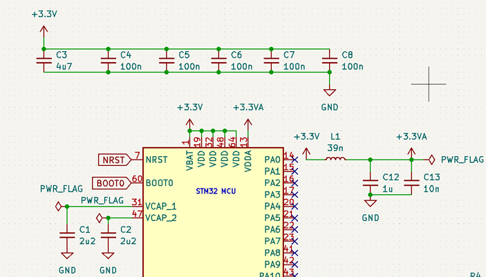

The MSP takes in a VIN range of 1.62-3.6V, so one can easily make a USB port-powered input and step down the voltage to 3.3V.

My design used the basic USB-C (non-PD) port that negotiates a 5V, 3A rail with any common USB-C cord. 
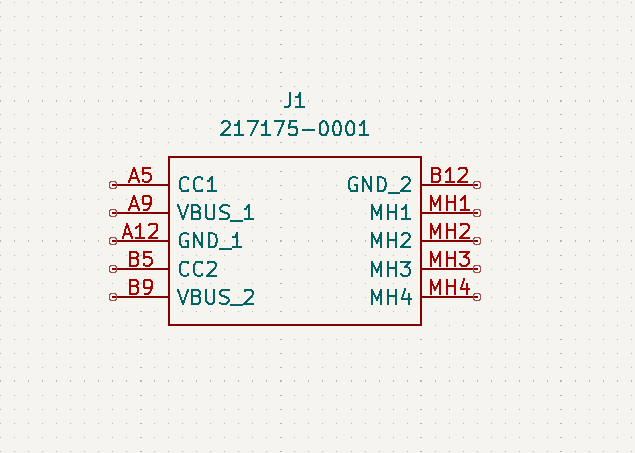

In any full design, one will want ESD protection for this port, since it connects to an external source of static. I included a basic ESD diote for this, the TPD6E004.

Finally, I have an LDO that takes the voltage down from 5V to 3.3V for the MSPM0. I used the TPS7A20 for this.

Once all the main components are gathered on the same schematic as this, one can proceed to fill out all the proper connections and passives.
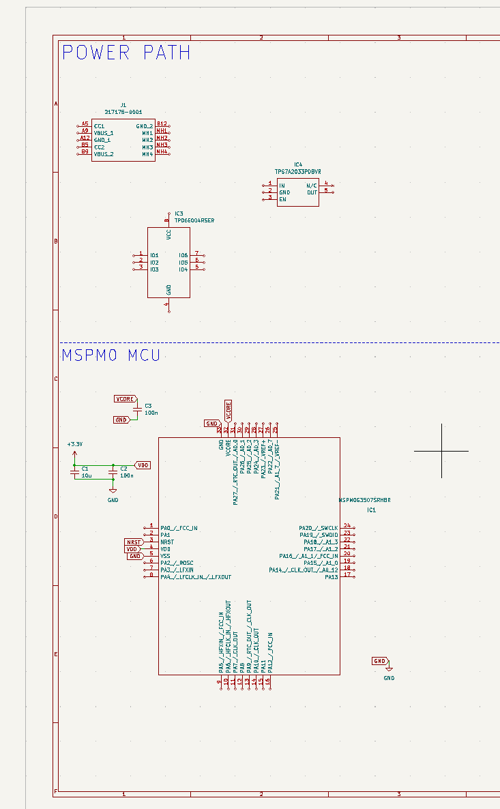

### First Connections

For the USB-C port, I recreated the connections found at this link: https://forum.digikey.com/t/simple-way-to-use-usb-type-c-to-get-5v-at-up-to-3a-15w/7016

I also wired the 5V line to the ESD diode to protect against voltage spikes from connecting the USB cable.

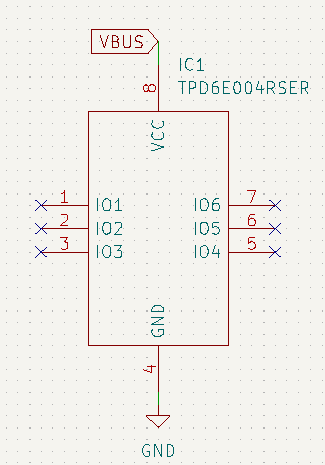

Note: If you were using the D+ and D- lines of the USB port, you'd connect them to these IOx pins, but we left them floating here. The CC1 and CC2 lines can alos be protected optionally, but that's out of the scope of this design.

Finally, we connect the 5V line to a 5V-3V3 LDO to provide a suitable voltage for our M0 MCU.

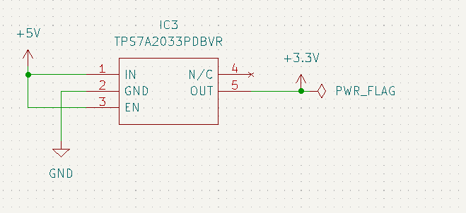

That's the basics. With these connectiond, our MCU is good to power up. It won't do too much until we add some way of connecting GPIO, activating peripherals, and adding a programming header.

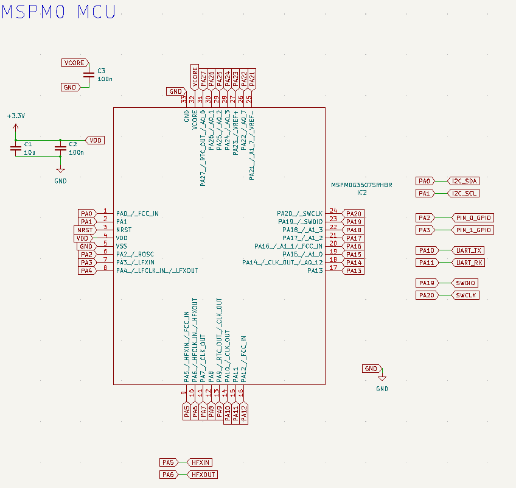

To make things easier organizationally, I like to add labels to every MCU pin, then reference label in other parts of schematic.

### Communication

To activate our communication lines, we will need to assign pins for I2C and UART

To do this, I will open up my selected device in Code Composer Studio. Once again, I am using MSPM0G3507.

To download CCS, you can find it [here](https://www.st.com/content/ccc/resource/technical/document/data_brief/b1/d8/13/d4/b0/b7/4b/6e/DM00214578.pdf/files/DM00214578.pdf/jcr:content/translations/en.DM00214578.pdf)

There's also a comprehensive walkthrough of CCS Theia and a MSPM0 board here which may be useful reading. I will go through a similar walkthrough for a blank project.

**Page 1: where you will input "MSPM0G3507" and click "Create a new project".**

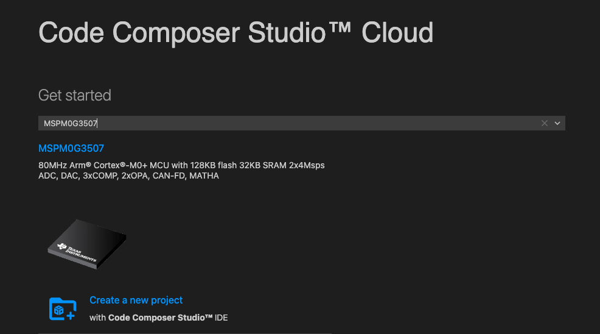

**Page 2: select "empty_driverlib.src".**
**You can name your project whatever you want, and pick the CCS_TI Arm Clang Compiler.**

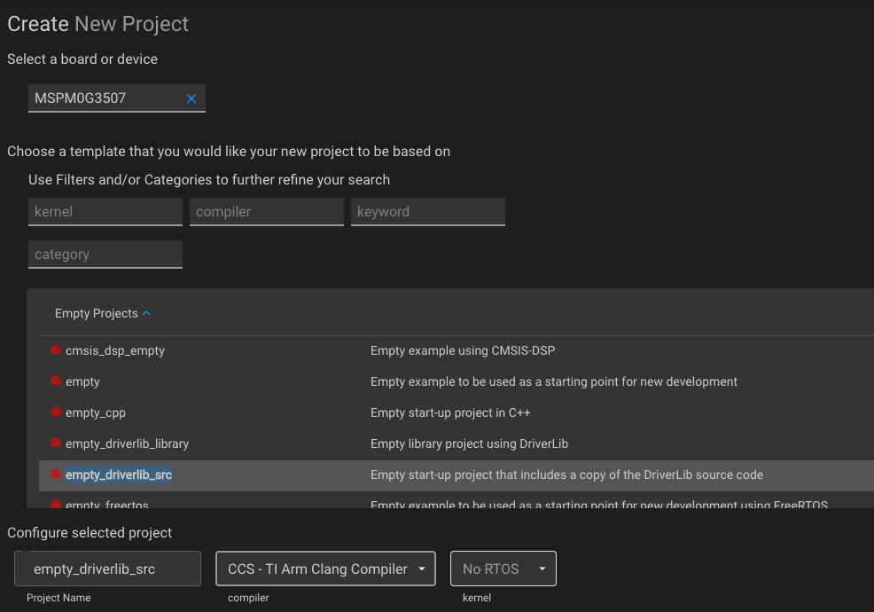

**You'll now have this README page and some tabs on the left.**
**The one you want to select is the "empty.syscfg".**

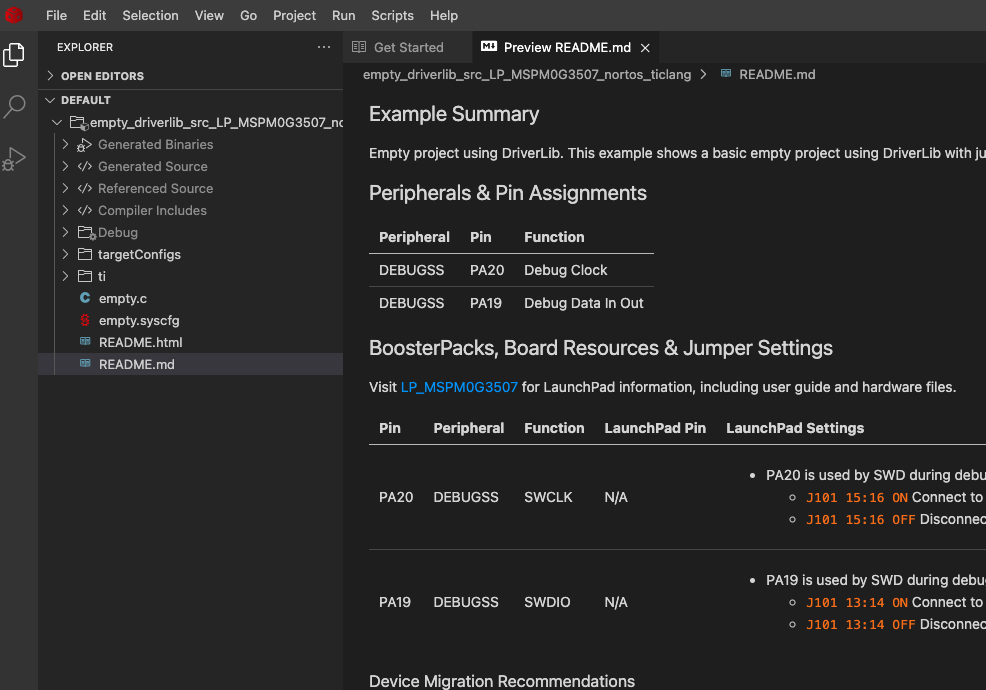

**This is where we se the configuration GUI, where we can activate all sorts of peripherals and generate code for drivers.**

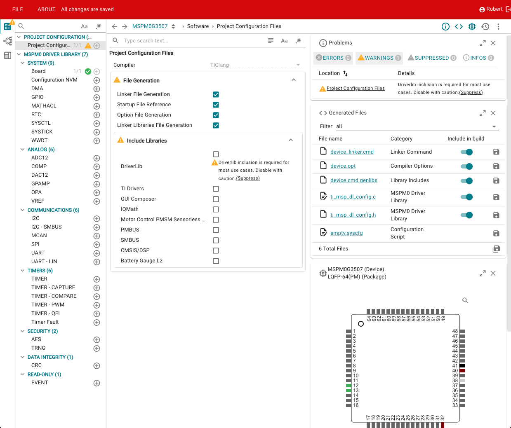

**We will need to make one small adjustment, as we need to switch the IDE ofer to the RHBR package with 32 pins.**
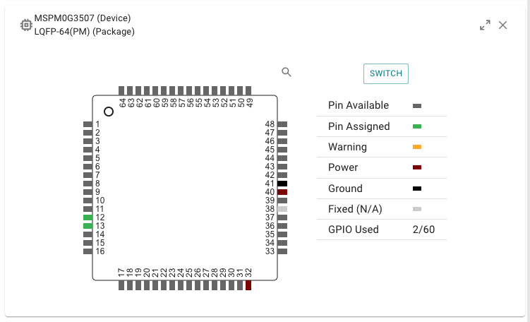

**Hit "switch" and then change the "LQFP-64" option to "VQFN-32"**

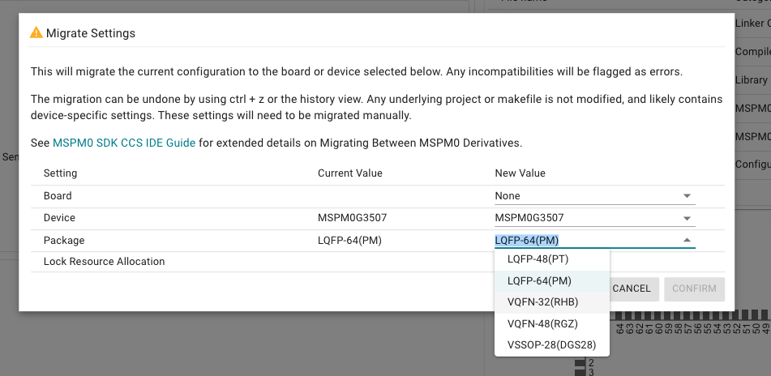

**Now we have the correct pins that correspond to our schematic symbol**

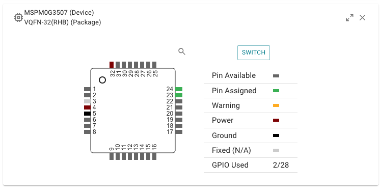

**Now, to start making our modifications**
**I will activate I2C by pressing the (+) icone next to them**

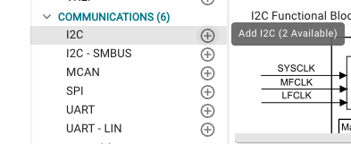

**This will automatically assign the I2C to pins 1(PA0) and 2(PA1). [SDA->PA0 and SCL->PA1]**
**You can change the pins in the PinMux menu at any time to your preference**

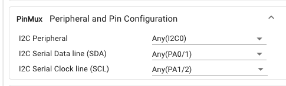

**I will also activate the UART pins and accept their default mapping to pins 14(PA10) and 15(PA11). [TX->PA10 and RX->PA11]**

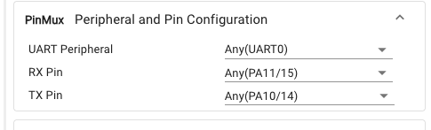

**Finally, I will add a couple GPIO outputs for us to seee the output behavior of simple programs**
**For me, these assigned to pins 6(PA2) and 7(PA3)**
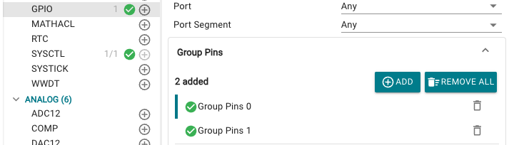

**FThe end result is that your device picture now has a graphical map for pin assignments, a handy tool for your schematic pin assignments Hovering over any of the pins shows its function**

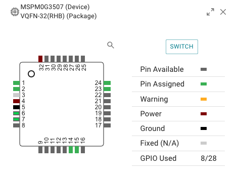

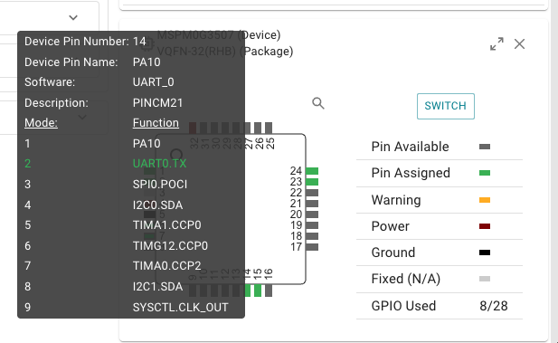

**We also see that, for the purpose of programming, Pin 24(PA20) is by default reserved for SWCLK, Pin 23(PA19) for SWDIO.**
**We'll return to this when it comes time to make the programming header**

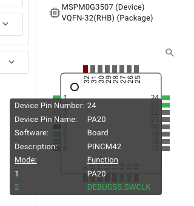

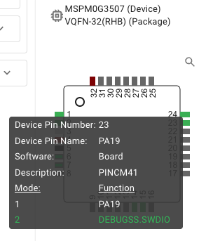

